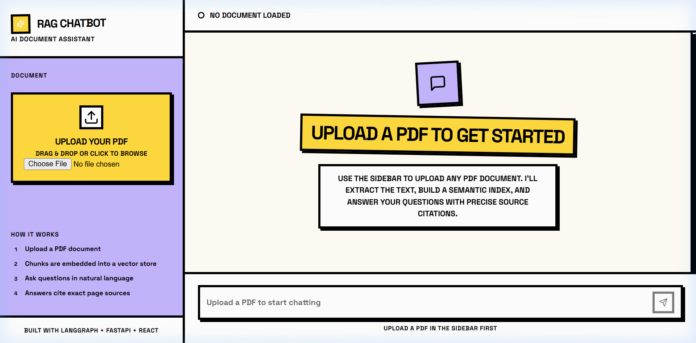

# Advanced AI RAG Chatbot

A production-deployed Retrieval-Augmented Generation (RAG) chatbot with stateful agentic orchestration, hybrid document retrieval, per-session vector isolation, and a custom Neo-Brutalist frontend.

### Live Deployment
- **Web Interface**: [https://tech-stalwarts-rag-chatbot.vercel.app](https://tech-stalwarts-rag-chatbot.vercel.app)
- **API Documentation**: [https://tech-stalwarts-rag-chatbot.vercel.app/docs](https://tech-stalwarts-rag-chatbot.vercel.app/docs)



---

## Key Features & Code Map

| Feature | Details | File |
| :--- | :--- | :--- |
| **PDF Ingestion** | Upload and extract text from any PDF | [`pdf_loader.py`](backend/app/ingestion/pdf_loader.py) — PyMuPDF extraction with page-level metadata |
| **Chunking** | Smart splitting with deduplication | [`chunker.py`](backend/app/ingestion/chunker.py) — 800-char recursive splits, MD5 content hashing |
| **Embeddings** | Zero-cost, zero-API TF-IDF vectorizer | [`embeddings.py`](backend/app/rag/embeddings.py) — Pure numpy TF-IDF, fitted per session corpus |
| **Vector Store** | In-memory cosine similarity search | [`vector_store.py`](backend/app/rag/vector_store.py) — Session-isolated numpy matrix store |
| **Hybrid Retrieval** | Best-of-both-worlds search | [`retriever.py`](backend/app/rag/retriever.py) — Dense TF-IDF + sparse BM25 fused via Reciprocal Rank Fusion (RRF) |
| **Stateful Pipeline** | Agentic graph orchestration | [`graph.py`](backend/app/rag/graph.py) — LangGraph `START → retrieve → generate → END` |
| **Hallucination Guard** | Grounded, citation-backed answers | [`prompts.py`](backend/app/rag/prompts.py) — Strict system prompt; refuses out-of-scope questions |
| **Token Streaming** | Real-time token-by-token output | [`main.py`](backend/app/main.py) — FastAPI `StreamingResponse` with Server-Sent Events (SSE) |
| **Frontend** | Custom Neo-Brutalist design system | [`frontend/src/`](frontend/src/) — React + Vite SPA |

---

## System Architecture

```
┌────────────────────────────────────────────────────────────────────────┐
│                     React SPA Frontend  (Vercel)                        │
│   ┌─────────────┐       ┌──────────────────────────────────────────┐   │
│   │ PDF Upload  │       │   Streaming Chat (SSE token-by-token)    │   │
│   │ Drag & Drop │       │   Space Grotesk Font & Neo-Brutalist UI  │   │
│   └──────┬──────┘       └───────────────────┬──────────────────────┘   │
└──────────┼──────────────────────────────────┼──────────────────────────┘
           │ POST /api/ingest                 │ POST /api/chat/stream
           ▼                                  ▼
┌────────────────────────────────────────────────────────────────────────┐
│                FastAPI Backend  (Vercel Serverless / Docker)            │
│                                                                        │
│   ┌────────────────────────────────────────────────────────────────┐   │
│   │                     LangGraph StateGraph                       │   │
│   │                                                                │   │
│   │     START ──► [retrieve_node] ──► [generate_node] ──► END      │   │
│   │                      │                     │                   │   │
│   │              Hybrid Retriever           ChatGroq               │   │
│   │           (TF-IDF + BM25 + RRF)       (Llama 3.1)             │   │
│   └──────────────────────┬─────────────────────┬───────────────────┘   │
└──────────────────────────┼─────────────────────┼───────────────────────┘
                           ▼                     ▼
               numpy In-Memory Store         Groq API
               Per-session isolation        Free Llama 3.1
               TF-IDF vector search         Inference
```

### Architecture Decisions

1. **Stateful Graph Orchestration (LangGraph)** — RAG nodes run as a typed `StateGraph`, making each step inspectable and extensible without rewriting pipeline logic.

2. **Hybrid Search (TF-IDF + BM25 + RRF)** — Fuses dense TF-IDF cosine similarity and sparse BM25 keyword scores via Reciprocal Rank Fusion. Handles both semantic and keyword-heavy queries reliably.

3. **Pure-numpy Embedding (No API, No Downloads)** — A TF-IDF vectorizer built entirely on `numpy` is fitted on each session's corpus at upload time. This avoids cloud embedding costs, eliminates ~400 MB of native ML dependencies, and stays well within Vercel's 500 MB function size limit.

4. **Session-Level Isolation** — Each uploaded document lives in its own in-memory collection keyed by a UUID. On session delete, the collection and its embeddings are fully evicted from memory.

5. **Robust Exception Handler** — A FastAPI global exception handler intercepts crashes and returns structured JSON to the UI, preventing cryptic HTTP 500 errors from reaching the user.

---

## Project Structure

```
advanced-ai-rag-chatbot/
├── backend/
│   ├── app/
│   │   ├── ingestion/
│   │   │   ├── pdf_loader.py      # PyMuPDF document loader
│   │   │   └── chunker.py         # Recursive text splitting + MD5 deduplication
│   │   ├── rag/
│   │   │   ├── embeddings.py      # Pure-numpy TF-IDF vectorizer (fitted per session)
│   │   │   ├── vector_store.py    # In-memory cosine similarity store
│   │   │   ├── retriever.py       # Hybrid BM25 + TF-IDF + RRF implementation
│   │   │   ├── prompts.py         # Hallucination-resistant system prompt
│   │   │   └── graph.py           # LangGraph StateGraph nodes
│   │   ├── config.py              # Pydantic-settings config
│   │   ├── utils.py               # Structured logger
│   │   └── main.py                # FastAPI endpoints & SSE streaming
│   ├── tests/
│   │   ├── conftest.py            # Fixtures & mock configurations
│   │   ├── test_ingestion.py      # PDF loader and chunker tests
│   │   ├── test_vector_store.py   # Vector store CRUD tests
│   │   └── test_rag_pipeline.py   # End-to-end pipeline tests (mocked LLM)
│   ├── Dockerfile                 # Multi-stage Python image
│   └── requirements.txt           # Production dependencies
├── frontend/
│   ├── src/
│   │   ├── api/client.js          # REST and SSE API client
│   │   ├── hooks/
│   │   │   ├── useChat.js         # SSE streaming chat hook
│   │   │   └── useIngest.js       # File upload progress hook
│   │   ├── components/
│   │   │   ├── Sidebar.jsx
│   │   │   ├── PDFUploader.jsx
│   │   │   ├── ChatWindow.jsx
│   │   │   ├── MessageBubble.jsx  # Streams markdown responses
│   │   │   ├── SourcePanel.jsx    # Collapsible page citations
│   │   │   ├── TypingIndicator.jsx
│   │   │   └── EmptyState.jsx
│   │   ├── App.jsx
│   │   └── index.css              # Neo-Brutalist design system
│   └── package.json
├── docs/
│   ├── demo_conversation.md       # Grounded 5-query transcript
│   └── sample.pdf                 # 4-page sample PDF about AI
├── docker-compose.yml             # Local multi-container dev environment
└── vercel.json                    # Monorepo unified deploy configuration
```

---

## Quick Start

### Prerequisites
- Python 3.11+
- Node.js 20+
- A free Groq API key from [console.groq.com](https://console.groq.com)

---

### Method A — Docker Compose

```bash
git clone https://github.com/Piyush-echelon/TechStalwarts-Rag-Chatbot.git
cd TechStalwarts-Rag-Chatbot
cp backend/.env.example backend/.env
# Add your GROQ_API_KEY to backend/.env
docker compose up --build
```

- Frontend: http://localhost:3000
- Backend API: http://localhost:8000
- Swagger Docs: http://localhost:8000/docs

---

### Method B — Local Development

**Backend:**
```bash
cd backend
python -m venv .venv
source .venv/bin/activate   # Windows: .venv\Scripts\activate
pip install -r app/requirements.txt
uvicorn app.main:app --reload --port 8000
```

**Frontend:**
```bash
cd frontend
npm install
npm run dev
# Opens at http://localhost:5173
```

---

## Running Tests

All Groq API calls are mocked. Tests run fully offline.

```bash
cd backend
source .venv/bin/activate
pytest tests/ -v --cov=app --cov-report=term-missing
```

### Coverage Results
```
Name                          Stmts   Miss  Cover
--------------------------------------------------
app/ingestion/chunker.py         31      2    94%
app/ingestion/pdf_loader.py      28      3    89%
app/main.py                     117     68    42%
app/rag/embeddings.py            11      3    73%
app/rag/graph.py                 63      3    95%
app/rag/retriever.py             47      0   100%
app/rag/vector_store.py          37      2    95%
--------------------------------------------------
TOTAL                           380     82    78%
```

27 tests passed.
